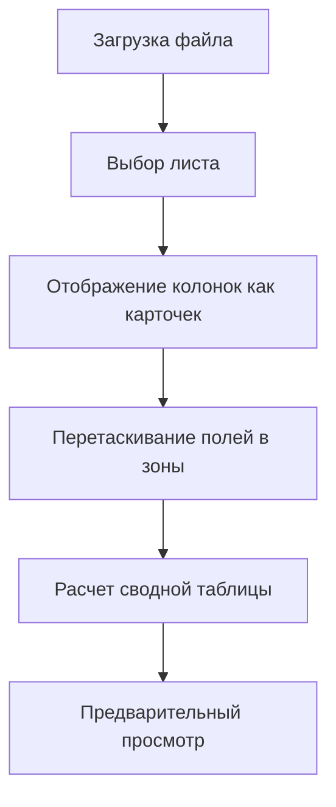

# План по созданию функционала Pivot

## Цели

- Создать страницу с механизмом Pivot, аналогичным Pivot в Excel.
- Реализовать загрузку одной основной таблицы с опциональной второй таблицей.
- Отображение колонок в виде карточек для перетаскивания.
- Создать три зоны для перетаскивания полей: строки, столбцы и значения.
- Реализовать специфическую логику преобразования поля BOM в заголовки столбцов и распределения значений QTY по соответствующим ячейкам.

## Шаги реализации

1. **Ограничение загрузки файлов**
   - Настроить компонент `FileUploader` для загрузки одной основной таблицы.
   - Сделать вторую загрузку опциональной, отображая ее только при необходимости.

2. **Отображение колонок как карточек**
   - Изменить отображение колонок на карточки, обеспечив возможность перетаскивания.
   - Убрать использование чекбоксов для выбора колонок.

3. **Создание зон для перетаскивания**
   - **Зона строк (Rows):** Позволяет перетаскивать несколько полей, которые будут отображаться как строки в сводной таблице.
   - **Зона столбцов (Columns):** Ограничить возможность перетаскивания только поля BOM, которое будет преобразовано в заголовки столбцов.
   - **Зона значений (Values):** Ограничить возможность перетаскивания только поля QTY, используемого для заполнения данных в ячейках.

4. **Реализация логики преобразования данных**
   - Обновить функцию `calculatePivotTable` для специфической обработки полей BOM и QTY:
     - Преобразовать значения BOM из строк в заголовки столбцов.
     - Распределить значения QTY по соответствующим ячейкам сводной таблицы на основе номеров BOM.

5. **Улучшение пользовательского интерфейса**
   - Добавить инструкции или подсказки для пользователей по использованию механизма Pivot.
   - Визуализировать ограничение на выбор полей для зон столбцов и значений.

6. **Тестирование функционала**
   - Провести тестирование с различными наборами данных для проверки корректности работы механизма Pivot.
   - Убедиться в правильности преобразования данных и отображения сводной таблицы.

## Диаграмма процесса

## Ожидаемые результаты

- Пользователь может загрузить одну основную таблицу и опционально вторую.
- Колонки отображаются в виде перетаскиваемых карточек.
- Поле BOM можно перетащить только в зону столбцов, а поле QTY — только в зону значений.
- После перетаскивания полей автоматический расчет сводной таблицы происходит корректно.
- Пользователь получает предварительный просмотр сформированной сводной таблицы.